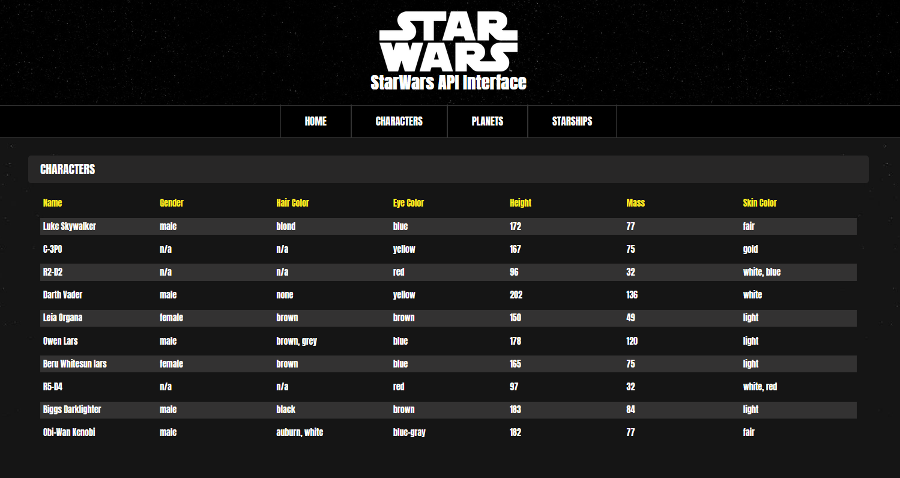

<p align="center">
    
</p>

## Table of contents
* [General info](#general-info)
* [Code organization](#code-organization)
* [Acknowledgements](#acknowledgements)
* [Setup](#setup)

## General info
This [Angular](https://angular.io) App is use of [SWAPI](https://swapi.co) to get characters, planets and starships from StarWars universe.
**Early stage of development**

## Code organization
    .
    ├── welcome                         # Component resposible for representing welcome page
    ├── characters                      # Component resposible for representing characters list
    ├── planets                         # Component resposible for representing planets list
    ├── starships                       # Component resposible for representing starships list
    ├── ui                              
        └── loading-spinner             # Component resposible for loading animation
    └── services
        ├── app.service.ts              # Main application service
        └── storage.service.ts          # Service responsible for session storage usage

## Acknowledgements
* [Spinkit](https://tobiasahlin.com/spinkit)
    
## Setup
To run project:
```
npm i
npm start
```
